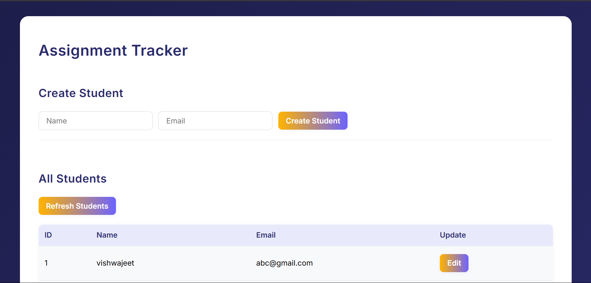
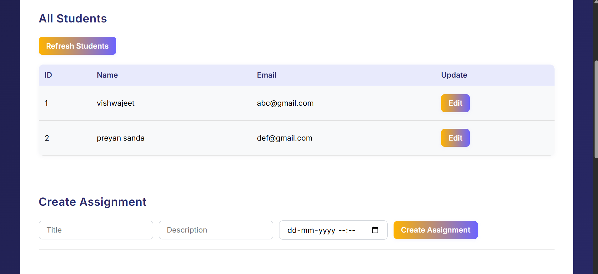
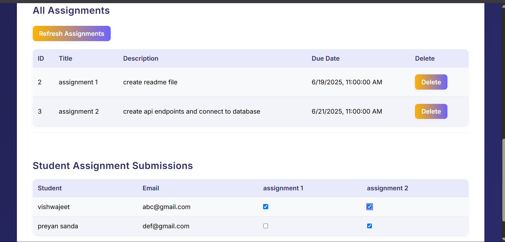

# Assignment Tracker Web Application

A web application to manage and track student assignment submissions, built with FastAPI, PostgreSQL, and a modern HTML/JS frontend.

---

## 📚 API Endpoints

### **Student APIs**
- `POST /students/`  
  Create a new student.  
  **Body:**  
  ```json
  { "name": "Alice", "email": "alice@example.com" }
  ```
- `GET /students/`  
  List all students.

- `PUT /students/{student_id}`  
  Update a student's name or email.  
  **Body:**  
  ```json
  { "name": "Alice Updated", "email": "alice@new.com" }
  ```

### **Assignment APIs**
- `POST /assignments/`  
  Create a new assignment.  
  **Body:**  
  ```json
  { "title": "Math HW", "description": "Algebra", "due_date": "2025-06-30T23:59:00" }
  ```
- `GET /assignments/`  
  List all assignments.

- `DELETE /assignments/{assignment_id}`  
  Delete an assignment and all related submissions.

### **Submission APIs**
- `GET /submissions/`  
  List all submissions.

- `POST /submissions/`  
  Mark an assignment as submitted by a student.  
  **Query params:**  
  `student_id`, `assignment_id`

- `DELETE /submissions/`  
  Mark an assignment as not submitted (remove submission).  
  **Query params:**  
  `student_id`, `assignment_id`

### **Status APIs**
- `GET /students/completed/{assignment_id}`  
  List students who have submitted a particular assignment.

- `GET /students/pending/{assignment_id}`  
  List students who have NOT submitted a particular assignment.

---

## 🗄️ Database

- **Database:** PostgreSQL
- **Models:**  
  - `Student` (id, name, email)  
  - `Assignment` (id, title, description, due_date)  
  - `Submission` (id, student_id, assignment_id, submitted_at)

**Integration:**  
SQLAlchemy ORM is used for all database operations.  
The connection string is set in `app/database.py`:
```python
DATABASE_URL = "postgresql+psycopg2://<user>:<password>@localhost/assignments_db"
```

---

## 🚀 How to Run the Server

1. **Install dependencies:**
   ```
   pip install -r requirements.txt
   ```

2. **Set up PostgreSQL:**
   - Create a database named `assignments_db`.
   - Update your username and password in `app/database.py` if needed.

3. **Run the server:**
   ```
   uvicorn app.main:app --reload
   ```

4. **API Docs:**  
   Visit [http://localhost:8000/docs](http://localhost:8000/docs) for interactive Swagger UI.

---

## 🌐 How to Run the Frontend

1. **Start the FastAPI server** (see above).
2. **Open the frontend:**  
   Go to [http://localhost:8000/static/index.html](http://localhost:8000/static/index.html) in your browser.

---

## 🛠️ How to Interact with the API

- **Create a student (example using `curl`):**
  ```
  curl -X POST "http://localhost:8000/students/" -H "Content-Type: application/json" -d "{\"name\": \"Alice\", \"email\": \"alice@example.com\"}"
  ```

- **Create an assignment:**
  ```
  curl -X POST "http://localhost:8000/assignments/" -H "Content-Type: application/json" -d "{\"title\": \"Math HW\", \"description\": \"Algebra\", \"due_date\": \"2025-06-30T23:59:00\"}"
  ```

- **Mark assignment as submitted:**
  ```
  curl -X POST "http://localhost:8000/submissions/?student_id=1&assignment_id=2"
  ```

- **List students who completed an assignment:**
  ```
  curl "http://localhost:8000/students/completed/2"
  ```

- **List students who have not submitted an assignment:**
  ```
  curl "http://localhost:8000/students/pending/2"
  ```

---

## 📸 Screenshots

### Student Assignment Tracker




---

## 📝 Notes

- The frontend provides forms and tables for all major actions.
- The backend is fully RESTful and can be used independently with tools like Postman or curl.
- All static files are served from the `/static` path.

---